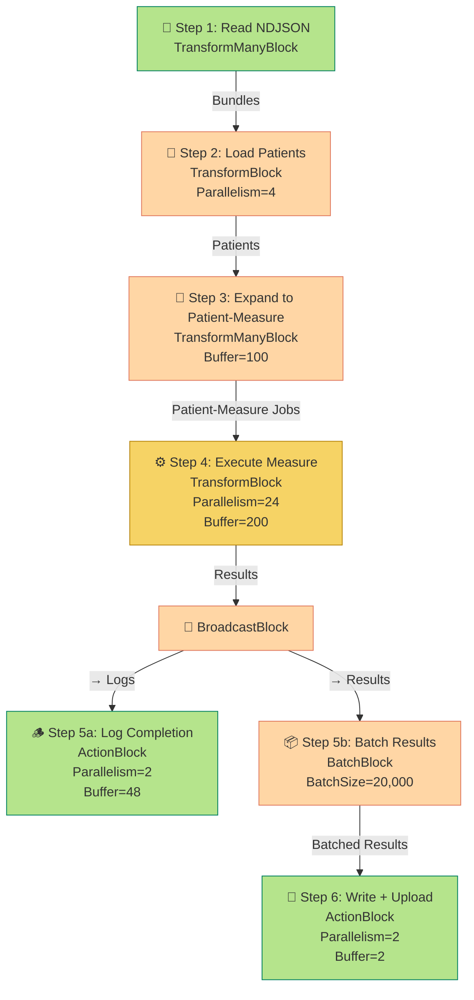

# 🧠 Patient-Measure Dataflow Pipeline

This repository contains a **TPL Dataflow-based pipeline** for processing large NDJSON datasets of **FHIR patient bundles** and executing multiple **clinical measures** per patient in parallel.

It uses **.NET’s Task Parallel Library (TPL) Dataflow** to handle asynchronous, parallel, and memory-efficient workloads — similar in concept to Go’s channels and pipelines.

---

## 📦 Getting Started

### 1. Prerequisites

- [.NET 8 SDK](https://dotnet.microsoft.com/download)
- Add NuGet package:
```bash
  dotnet add package System.Threading.Tasks.Dataflow
```

* Input file: NDJSON file of patient bundles (`patients.ndjson`)
* Configuration file or environment variables for Cloud Storage output path, parallelism, and batch size (optional)

---

## ⚙️ Configuration Overview

Configuration is handled via the `DataflowPipelineConfig` class:

| Setting                  | Default                             | Description                               |
| ------------------------ | ----------------------------------- | ----------------------------------------- |
| `InputNdjsonPath`        | `/path/to/patients.ndjson`          | Path to input file                        |
| `OutputNdjsonPath`       | `/path/to/results.ndjson`           | Local results file                        |
| `OutputCloudStoragePath` | `gs://bucket/prefix/results.ndjson` | Cloud Storage destination                 |
| `LoadPatientParallelism` | 4                                   | Number of parallel patient loaders        |
| `PatientMeasureBuffer`   | 100                                 | Buffer size for patient→measure expansion |
| `ExecuteParallelism`     | 24                                  | Number of concurrent measure executions   |
| `ExecuteBuffer`          | 200                                 | Buffer size for measure execution queue   |
| `LogParallelism`         | 2                                   | Parallel log writers                      |
| `LogBuffer`              | 48                                  | Log queue size                            |
| `BatchSize`              | 20,000                              | Results per NDJSON batch                  |
| `WriteParallelism`       | 2                                   | File writers / uploaders                  |
| `WriteBuffer`            | 2                                   | Writer buffer depth                       |
| `EnsureOrdered`          | false                               | Preserve message ordering (optional)      |

---

## 🧩 Core Concepts: TPL Dataflow

TPL Dataflow (Task Parallel Library Dataflow) is a .NET library for building **asynchronous, message-based pipelines**.

Each stage of the pipeline is represented by a *block*, which may:

* **Receive data** (target block)
* **Process data** (transform block)
* **Emit data** (source block)

Blocks can be connected with `LinkTo()`, and each block runs asynchronously with configurable **parallelism** and **bounded capacity** (backpressure).

Key block types used here:

* **TransformBlock** — processes or converts input to output (parallel map)
* **TransformManyBlock** — expands one input into multiple outputs
* **BroadcastBlock** — sends each message to multiple downstream consumers
* **BatchBlock** — groups multiple messages into fixed-size batches
* **ActionBlock** — performs a terminal action (e.g. write, log)

---

## 🧮 Pipeline Flow

Below is a summary of the stages implemented in this pipeline:

| Step | Description                                       | Parallelism | Buffer | Block Type         |
| ---- | ------------------------------------------------- | ----------- | ------ | ------------------ |
| 1    | Read NDJSON file lines → PatientBundles           | —           | 1      | TransformManyBlock |
| 2    | Parse patient JSON bundles into objects           | 4           | 16     | TransformBlock     |
| 3    | Expand each patient into measure jobs             | 1           | 100    | TransformManyBlock |
| 4    | Execute each patient-measure pair                 | 24          | 200    | TransformBlock     |
| 5a   | Log results                                       | 2           | 48     | ActionBlock        |
| 5b   | Batch results into NDJSON chunks                  | —           | 40,000 | BatchBlock         |
| 6    | Write batch to NDJSON and upload to Cloud Storage | 2           | 2      | ActionBlock        |

---

## 🧭 Mermaid Dataflow Diagram



---

## 🧠 How It Works

1. **Reading** — the pipeline reads each line (patient bundle) from an NDJSON file as a streaming sequence.
2. **Loading** — patient JSON is parsed and hydrated into memory concurrently (`MaxDegreeOfParallelism = 4`).
3. **Expansion** — each patient expands into N work items, one per measure.
4. **Execution** — each patient-measure pair runs in parallel (`MaxDegreeOfParallelism = 24`).
   Backpressure is controlled by `BoundedCapacity = 200`.
5. **Logging & Batching** — completed results are broadcast to both:

   * a logger (for metrics, progress)
   * a batch collector (for NDJSON output)
6. **Writing** — batches are serialized and written to disk/cloud in parallel (`Parallelism = 2`).

Completion signals (`PropagateCompletion = true`) flow downstream so the pipeline shuts down cleanly once upstream work is done.

---

## 📊 Operational Notes

| Metric                     | Description                                                         |
| -------------------------- | ------------------------------------------------------------------- |
| **Throughput**             | Total patients × measures processed per second                      |
| **Backpressure**           | Queue depth in bounded blocks (e.g., 200 for execution)             |
| **Memory Control**         | Bounded capacities prevent runaway memory growth                    |
| **Parallel Scaling**       | Tune stage parallelism independently (e.g., more measure executors) |
| **Batch Size**             | Adjust to balance I/O efficiency and latency                        |
| **Completion Propagation** | Ensures graceful shutdown and no message loss                       |

---

## 🔧 Extending the Pipeline

You can extend or modify stages easily:

* Add additional TransformBlocks for validation or enrichment
* Insert filtering with `LinkTo(..., predicate)`
* Replace NDJSON writer with a database or message queue sink
* Adjust per-stage `ExecutionDataflowBlockOptions` for new hardware or workload characteristics

---

## 🧾 Summary

* **TPL Dataflow** provides a powerful, configurable framework for parallel pipelines.
* Each stage handles its own concurrency, buffering, and completion.
* The overall pattern is highly similar to Go pipelines but integrates seamlessly with C# async/await.
* The provided structure can handle millions of patient-measure executions efficiently.

---

> 📘 For deeper understanding:
>
> * [Microsoft Docs: Dataflow (Task Parallel Library)](https://learn.microsoft.com/en-us/dotnet/standard/parallel-programming/dataflow-task-parallel-library)
> * [Stephen Toub: Dataflow Patterns and Practices](https://devblogs.microsoft.com/pfxteam/)
> * [System.Threading.Channels vs Dataflow comparison](https://learn.microsoft.com/en-us/dotnet/core/extensions/channels)

---
