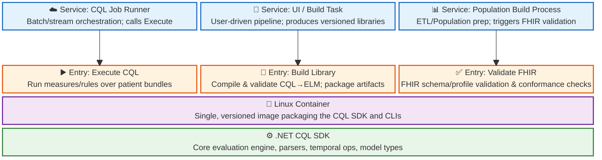
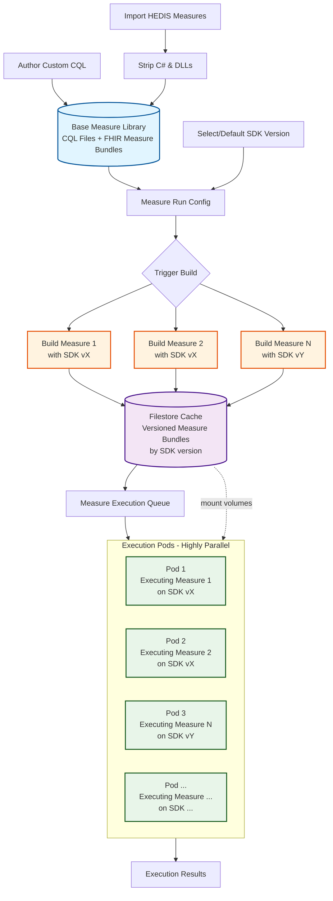

# CQL SDK Container Architecture

This document describes the containerization strategy for the CQL SDK and how it integrates with various services in the system.

## CQL Container Design

The following diagram illustrates the four-layer architecture, showing how services interact with containerized CQL SDK entry points.

**Layer 1 - Core SDK**: The .NET CQL SDK provides the foundational evaluation engine, parsers, temporal operations, and model types.

**Layer 2 - Containerization**: A single, versioned Linux container image packages the CQL SDK and CLI tools, ensuring consistent runtime environments.

**Layer 3 - Entry Points**: The same container image supports multiple entry points (execute, build, validate) through different commands.

**Layer 4 - Services**: Various services invoke the appropriate entry points based on their needs (job execution, library building, FHIR validation).

## Measure Build and Execution Pipeline

This workflow shows the end-to-end process from measure authoring/import through build, caching, and parallel execution across pods.

### Key Components

**Input Sources**:

- Custom CQL files authored by users
- HEDIS measures imported from external sources (C# and DLLs are stripped to ensure we build with our versioned SDK)

**Base Measure Library**: Central repository storing CQL files and FHIR measure bundles (metadata).

**SDK Version Selection**: Each measure run configuration specifies which SDK version to use for building, ensuring compatibility and reproducibility.

**Parallel Builds**: Multiple measures can be built simultaneously using different SDK versions as needed.

**Filestore Cache**: Versioned measure bundles are stored in a shared filestore, organized by SDK version, which execution pods mount as volumes.

**Highly Parallel Execution**: Multiple pods execute different measures concurrently, each using the appropriate SDK version specified during the build phase.

