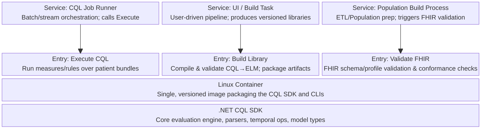
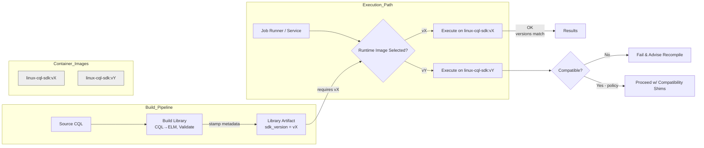
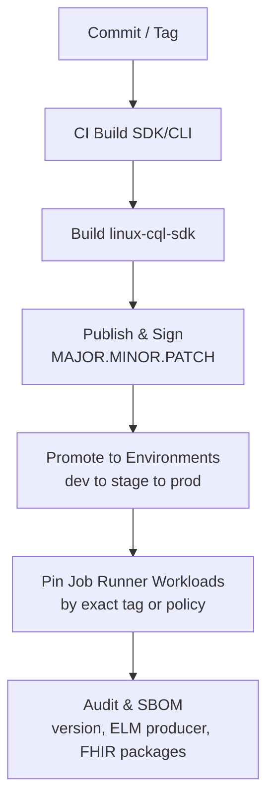
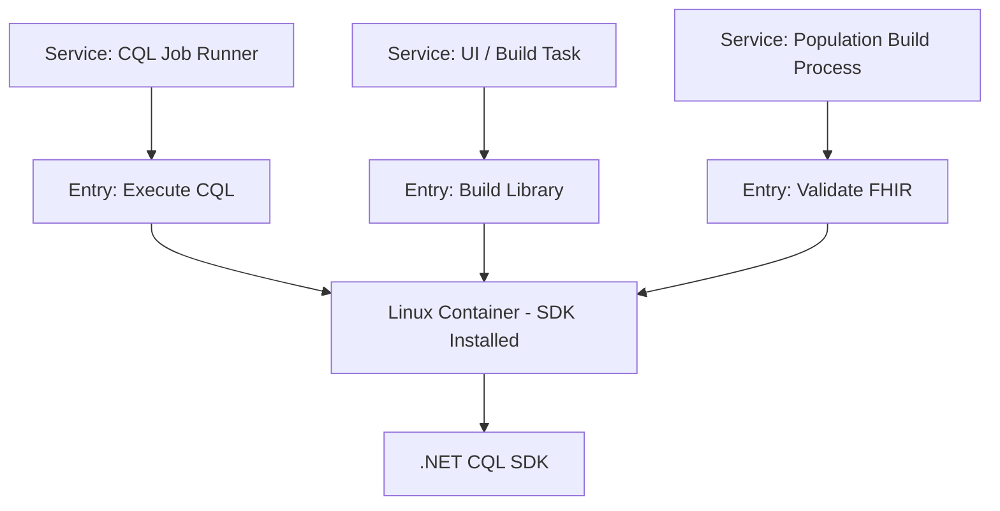

```mermaid
block-beta
  columns 3

  %% LAYER 4 — Callers/Services
  svc_exec["Service: CQL Job Runner<br/>Batch/stream orchestration; calls Execute"]
  svc_build["Service: UI / Build Task<br/>User-driven pipeline; produces versioned libraries"]
  svc_pop["Service: Population Build Process<br/>ETL/Population prep; triggers FHIR validation"]

  space:3

  %% LAYER 3 — Entry Points (same image, different commands)
  exec["Entry: Execute CQL<br/>Run measures/rules over patient bundles"]
  buildlib["Entry: Build Library<br/>Compile & validate CQL→ELM; package artifacts"]
  validate["Entry: Validate FHIR<br/>FHIR schema/profile validation & conformance checks"]

  %% LAYER 2 — Containerization
  container["Linux Container<br/>Single, versioned image packaging the CQL SDK and CLIs"]:3

  %% LAYER 1 — Core SDK
  core[".NET CQL SDK<br/>Core evaluation engine, parsers, temporal ops, model types"]:3

  %% FLOWS BETWEEN LAYERS
  svc_exec --> exec
  svc_build --> buildlib
  svc_pop --> validate
```

```mermaid
flowchart LR
    subgraph Build_Pipeline
      direction TB
      B0[Source CQL] --> B1["Build Library<br/>CQL→ELM, Validate"]
      B1 -->|stamp metadata| B2["Library Artifact<br/>sdk_version = vX"]
    end

    subgraph Container_Images
      direction TB
      I1[linux-cql-sdk:vX]:::img
      I2[linux-cql-sdk:vY]:::img
    end

    subgraph Execution_Path
      direction TB
      E0[Job Runner / Service] --> E1{Runtime Image Selected?}
      E1 -->|vX| E2[Execute on linux-cql-sdk:vX]
      E1 -->|vY| E3[Execute on linux-cql-sdk:vY]
    end

    B2 -->|requires vX| E1
    E2 -->|OK<br/>versions match| R1[Results]
    E3 --> E4{Compatible?}
    E4 -->|No| R2[Fail & Advise Recompile]
    E4 -->|Yes - policy| R3[Proceed w/ Compatibility Shims]

    classDef img fill:#eee,stroke:#666,stroke-width:1px;
```

```mermaid
flowchart TB
    A[Commit / Tag] --> B[CI Build SDK/CLI]
    B --> C[Build linux-cql-sdk]
    C --> D[Publish & Sign<br/>MAJOR.MINOR.PATCH]
    D --> E[Promote to Environments<br/>dev to stage to prod]
    E --> F[Pin Job Runner Workloads<br/>by exact tag or policy]
    F --> G[Audit & SBOM<br/>version, ELM producer, FHIR packages]
```

```mermaid
flowchart TB
  %% LAYER 4 — Callers
  A1[Service: CQL Job Runner] --> B1[Entry: Execute CQL]
  A2[Service: UI / Build Task] --> B2[Entry: Build Library]
  A3[Service: Population Build Process] --> B3[Entry: Validate FHIR]

  %% LAYER 3 → 2 → 1
  B1 --> C["Linux Container - SDK Installed"]
  B2 --> C
  B3 --> C
  C  --> D[.NET CQL SDK]
```